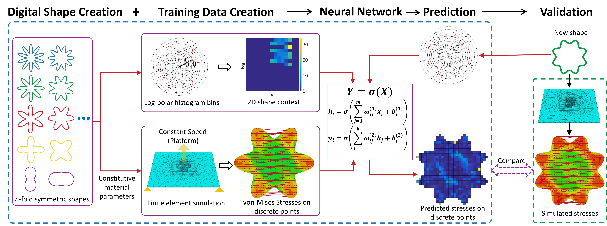

# SLAPred_CAD_2018
Code associated with our published CAD paper: [Data-driven simulation for fast prediction of pull-up process in bottom-up stereo-lithography](https://doi.org/10.1016/j.cad.2018.02.002)

